<!-- ───────────────────────────────────────────────────────────
     PRATHAM JOSHI · github profile
     banner lives at assets/header.svg — keep them together
─────────────────────────────────────────────────────────── -->

<a href="https://prathamj07.github.io">
  
</a>

<p align="center">
  <a href="https://prathamj07.github.io"></a>&nbsp;
  <a href="https://linkedin.com/in/pratham-joshi-7b7516172"></a>&nbsp;
  <a href="mailto:prathamj7703@gmail.com"></a>&nbsp;
  <a href="https://leetcode.com/u/s0mQSFPer6"></a>
</p>

---

### `❯ whoami`

CS undergrad — AI/ML honors, CGPA 9.5 at IPS Academy, Indore — graduating June 2026.

At **[WeDecode.io](https://wedecode.io)** I build the backend for **gym environments** that train and evaluate AI agents: synthetic data generation with LLMs, RL-based evaluation pipelines, and open-source SaaS stacks (OpenEMR, Frappe, Rocket.Chat) wired into controllable, production-like worlds an agent can actually operate inside.

Before that — an OCR + blockchain document-verification pipeline at **THDC India**, and an LLM lead-gen system at **Valency Renewable** (8K+ records, ~35% efficiency lift).

I shoot photographs and write the rest of the time. The portfolio carries those.

---

### `❯ ls projects/`

**🧠 [Recall](https://github.com/Prathamj07/recall)** — AI knowledge-management platform
> Semantic RAG over six content types, a conversational memory assistant, real-time handwritten-math recognition with step-by-step solving, and a slide-deck generator from a single topic.
> `React 18` · `TypeScript` · `Supabase` · `pgvector` · `Gemini 2.5` · `GPT-5` · `KaTeX` · `Deno`

**🎙️ [Anuvaad AI](https://github.com/Prathamj07/anuvaad-ai)** — multilingual dubbing studio
> Speech recognition → neural translation → voice cloning across 50+ languages. Ships an article-to-podcast converter alongside it.
> `Python` · `Flask` · `Whisper` · `Coqui-TTS` · `ElevenLabs` · `LangChain`

**📋 [AcadBoost](https://github.com/Prathamj07/acadboost)** — academic profiles + AI résumé engine
> Role-based records with automated LaTeX résumé generation (94% ATS compliance) and an analyzer that tells you *why* a résumé fails ATS, not just that it does.
> `Python` · `Streamlit` · `Gemini` · `MongoDB` · `LaTeX` · `LangChain`

---

### `❯ cat stack.py`

```python
stack = {
    "languages":  ["Python", "C++", "SQL"],
    "ml_ai":      ["PyTorch", "TensorFlow", "Scikit-learn", "LLMs", "RAG", "RL"],
    "frameworks": ["FastAPI", "Flask", "LangChain", "Hugging Face", "Django"],
    "data":       ["PostgreSQL", "MongoDB", "Redis", "Supabase", "pgvector"],
    "infra":      ["Docker", "GitHub Actions", "Google Cloud", "Git"],
    "tools":      ["Pandas", "NumPy", "Selenium", "Power BI", "Postman"],
}
```

---

### `❯ git log --grep="recognition"`

**Smart India Hackathon** · Government of India

| Year | Result | Build |
|:----:|:-------|:------|
| `2025` | 🏅 National Finalist | selected under the Ministry of Home Affairs |
| `2024` | 🏅 National Finalist | AI-driven cybersecurity solution · top team of 15K+ |
| `2023` | 🥇 **Winner** | blockchain product-verification system · 1st of 250+ teams |

---

### `❯ uptime`
 
<div align="center">


</div>

<div align="center">


</div>

<table align="center" width="100%"><tr>
<td align="center" width="50%">

[](https://leetcode.com/u/s0mQSFPer6)

</td>
<td align="center" width="50%">


</td>
</tr></table>


---

<p align="center">
  <sub><code>📍 22.72°N 75.86°E · Indore, India</code> &nbsp;·&nbsp; <b>open to roles from July 2026</b></sub>
</p>
